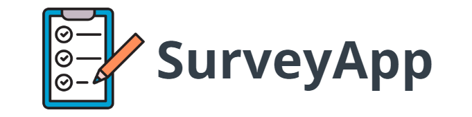

<h1 align="center">
    
</h1>
<h2 align="center">
  <span>🔗</span><a href="https://surveyapp-4gcjls0ai-devjeanfraga.vercel.app/">Live Demo</a> 
</h2>

## 📕 About
#### Aplicação com API de cadastro, login, criação, listagem, resposta e resultado da enquete.
#### [Link Back End](https://github.com/devjeanfraga/clean-architecture-survey-api)

### Prerequisites

Before you begin, ensure you have met the following requirements:

* [Git](https://git-scm.com/downloads "Download Git") must be installed on your operating system.

### Run Locally

To run **Survey App** locally, run this command on your git bash:

Linux and macOS:

```bash
sudo git clone https://github.com/devjeanfraga/survey-app-front.git
```

Windows:

```bash
git clone https://github.com/devjeanfraga/survey-app-front.git
```

## 🔨 Tools
- [React](https://pt-br.legacy.reactjs.org/)
- [TypeScript](https://www.typescriptlang.org/)
- [HTML](https://developer.mozilla.org/pt-BR/docs/Web/HTML) 
- [CSS](https://developer.mozilla.org/pt-BR/docs/Web/CSS)

## 📜 Licence 
[MIT](https://choosealicense.com/licenses/mit/)
